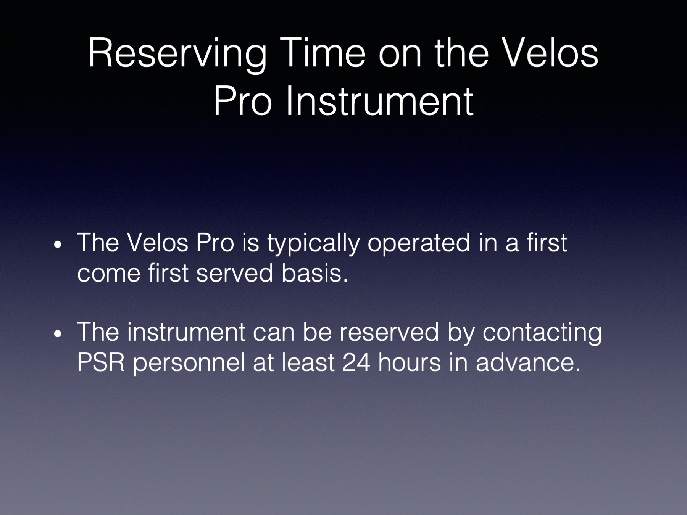
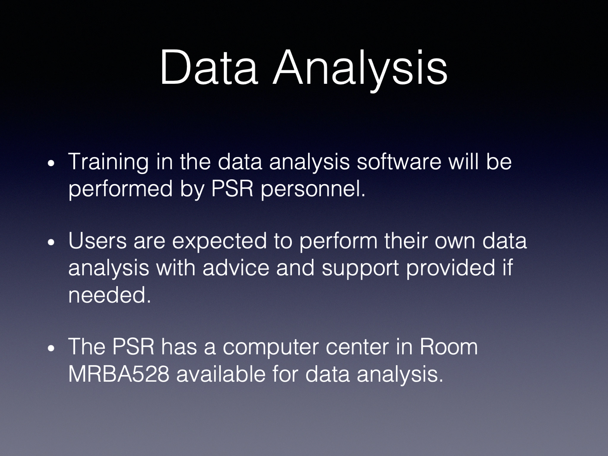

# Velos_Pro_Use

Capabilities and how to use the Velos Pro linear ion trap.

---

# Use of the OHSU PSR Velos Pro ion trap

## author: Keith Zientek
## affiliation: OHSU PSR
## data: April 2020

---

_Slide 1_

Welcome. This brief tutorial describes OHSU researchers using the Thermo Velos mass spectrometer in the OHSU PSR core.

---

_Slide 2_

This instrument in the core is a basic linear ion trap from Thermo Finnegan. It is quite robust and is available for use by any OHSU researcher who has completed training from the OHSU PSR core staff.

---

_Slide 3_

The OHSU PSR core has high-resolution instruments for shotgun identification and quantification proteomics experiments. The linear trap is available for basic mass spectrometry measurements to support research such as expression and purification of protein constructs. Some of the more common uses are peptide (less than 5000 Da) mass measurements and smaller protein whole masses (5K to 50K Da). A variety of dissociation methods are available to fragment and sequence peptides, too. Reverse-phase liquid chromatography using C18 (peptides) or C4 (proteins) columns are available for purification/separations.

---

_Slide 4_

If you have sufficiently purified starting material, HPLC may not be needed. Direct infusion via syringe is the fastest way to get data on your samples. The samples need to be in solutions that are compatible with the highly sensitive instrument. Sample volumes and concentrations also need to be within specified ranges.

---

_Slide 5_

Here are some of the buffer constraints. The main concerns are that particulates and detergents, although common in regular sample handling, are **not** compatible with the instrument. The buffers also need some source of hydrogen ions (H+ in acidic solutions) to create ions that the mass spectrometer manipulates and measure.

---

_Slide 6_

HPLC chromatography with reverse phase C18 or C4 columns are available for separations of analytes of interest. It may not be practical to start with very highly purified samples, and HPLC may be used to produce cleaner analytes for detailed measurements.

---

_Slide 7_

After you are trained and qualified to operate the Velos Pro instrument, it is available on a first come first served basis. The instrument can also be reserved for planned experiments.

---

_Slide 8_

Operation of the instrument requires training by the OHSU PSR core staff. Analysis of the generated data is also part of the instrument use. The OHSU PSR core has proprietary vendor software on core computers available for use in room MRBA528. The PSR core staff provide training in the software use. The analysis of the types of data generated by the Velos Pro is within the capabilities of trained users, and users are expected to perform their own analysis. The core staff is happy to answer any questions and provide help.

---

Thank you!
